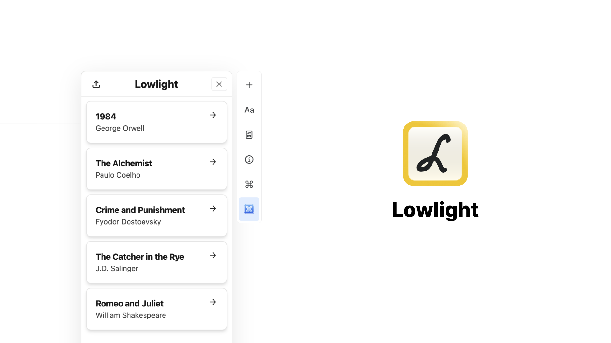

# Lowlight - Craft Extension for your Kindle highlights

Lowlight tries to help you use your Kindle highlights inside your notes. My main goal was to solve my issue of trying to write book summaries with a combination of highlights from the book. 

## Features
- 🔦 Highlight import from Kindle
- 📚 Displaying imported books and authors
- 📑 Displaying imported highlights
- 📇 Option to add a specific highlight to your Craft page

## Download
[Download here](https://github.com/cernezan/lowlight/releases)

You can learn more about instaling Craft extensions [here](https://www.craft.do/s/OhmDYXrBwI2wZS/b/B7626434-BB54-450E-8C2E-7D67D4C30431/Hacker_News).

Download the latest version of the extension [here]().

## Wanna help me out?

This is my first React project and also my first Craft extension. I'm sure I didn't follow the best practices when it comes to React but I'm trying to improve. I'm welcoming any feedback regarding the code and the extension itself.

### Building the extension from source

Simply run `npm install` and then `npm run build` to generate the .craftX file which can be installed.
You can use `npm run dev` to test and debug in your local environment

To learn more about Craft eXtensions visit the [Craft X developer portal](https://developer.craft.do).

### Technologies Used 

- 👨‍💻 React
- 💨 TailwindCSS
